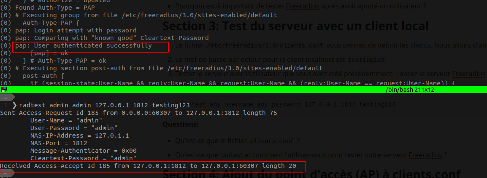
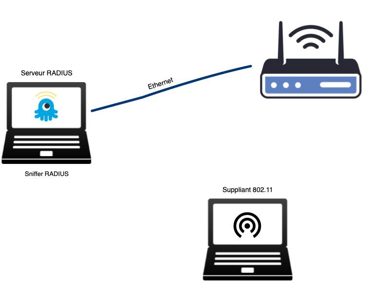
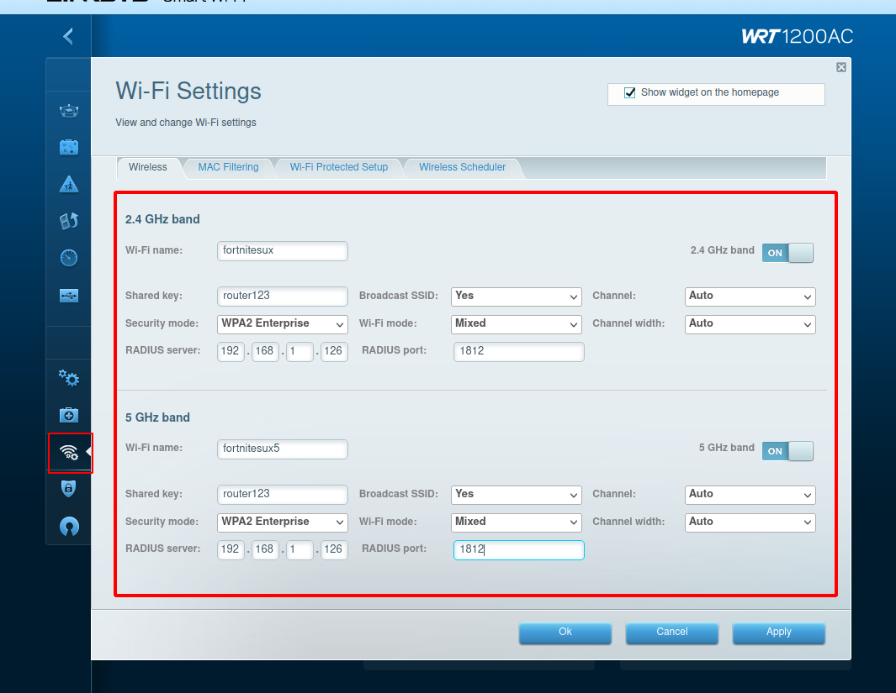

# Configuration d'un serveur Freeradius pour un réseau 802.11 Enterprise


- [Introduction](#introduction)
- [Section 1: Installation et configuration initiale de Freeradius](#section-1-installation-et-configuration-initiale-de-freeradius)
- [Section 2: Ajout d'un utilisateur](#section-2-ajout-dun-utilisateur)
- [Section 3: Test du serveur avec un client local](#section-3-test-du-serveur-avec-un-client-local)
- [Section 4: Ajout du point d'accès (AP) à clients.conf](#section-4-ajout-du-point-daccès-ap-à-clientsconf)
- [Section 5: Configuration du point d'accès pour la connexion Enterprise](#section-5-configuration-du-point-daccès-pour-la-connexion-enterprise)
- [Section 6: Configuration des méthodes d'authentification](#section-6-configuration-des-méthodes-dauthentification)
- [Section 7: Captures](#section-7-captures)

## Introduction

Dans ce laboratoire, nous allons apprendre à configurer un serveur Freeradius pour créer un réseau 802.11 Enterprise. La configuration d'un tel réseau est une compétence essentielle pour tout ingénieur en sécurité ou administrateur de réseau car elle permet de sécuriser la connexion sans fil dans un environnement d'entreprise. Freeradius est l'un des serveurs RADIUS les plus populaires et les plus utilisés, grâce à sa flexibilité et à sa fiabilité.

La norme 802.11 Enterprise diffère des configurations WPA et WPA2 personnelles plus courantes. Tandis que WPA et WPA2 personnelles utilisent une clé pré-partagée (PSK) pour tous les utilisateurs, la configuration Enterprise utilise un serveur RADIUS pour authentifier chaque utilisateur individuellement. Cela offre un niveau de sécurité plus élevé, car chaque utilisateur a ses propres identifiants, et permet une gestion plus fine des droits d'accès.

La raison pour laquelle nous utilisons Freeradius est qu'il offre un large éventail de fonctionnalités et est soutenu par une communauté active. Il est capable de supporter un grand nombre de demandes simultanées et offre une multitude d'options de configuration pour répondre à différents besoins et scénarios. Dans ce laboratoire, nous nous concentrerons sur la configuration de base pour mettre en place une authentification via un point d'accès.


## Section 1: Installation et configuration initiale de Freeradius

1. Commencez par installer Freeradius en utilisant la commande suivante :

    ```
    apt install freeradius
    ```

2. Arrêtez le service Freeradius. Cela nous permettra de le faire fonctionner en mode debug :

    ```
    sudo service freeradius stop
    ```

3. Testez Freeradius en mode debug avec la commande suivante :

    ```
    freeradius -X
    ```

   Vous pouvez arrêter le mode debug à tout moment en appuyant sur `Ctrl-C`.

**Questions:**

- Qu'est-ce que le mode debug et pourquoi est-il utile dans cette situation ?

  > Cela nous permet de voir et comprendre le fonctionnement du serveur. On peut ainsi configurer le serveur correctement.
- Que se passe-t-il si vous essayez de lancer Freeradius en mode debug alors que le service est en cours d'exécution ?

  > Failed binding to auth address 127.0.0.1 port 18120 bound to server inner-tunnel: Address already in use 
  > /etc/freeradius/3.0/sites-enabled/inner-tunnel[33]: Error binding to port for 127.0.0.1 port 18120

## Section 2: Ajout d'un utilisateur

1. Pour ajouter un utilisateur, vous devez éditer le fichier suivant : `/etc/freeradius/3.0/users`. En fait, le chemin correct dans la dernière version de Freeradius est `/etc/freeradius/3.0/mods-config/files/authorize`. 

2. Ajoutez un utilisateur en suivant cet exemple :

    ```
    any_username Cleartext-Password := “any_password”
    ```

    > admin Cleartext-Password := "admin"

3. Testez Freeradius en mode debug à nouveau pour voir si l'utilisateur a été correctement ajouté.

    > L'utilisateur n'apparait pas dans l'output du mode debug mais il apparait avec la commande suivante
    >
    > ```bash
    > radtest admin admin 127.0.0.1 1812 testing123
    > ```
    >
    > 

**Questions:**

- Que représente la ligne que vous avez ajoutée au fichier ?

  > Elle définit un utilisateur du serveur radius. Nous avons configuré le minimum: login/password (nous avons du indiquer que l'authentification se fait avec mot-de-passe en clair).
  > Plus d'options sont possibles, nous pouvons voir l'exemple "steve" présent dans le fichier
- Pourquoi est-il important de tester Freeradius après avoir ajouté un utilisateur ?

  > Si l'utilisateur n'a pas été ajouté, il y a un problème avec l'installation


## Section 3: Test du serveur avec un client local

1. Le fichier `/etc/freeradius/3.0/clients.conf` vous permet de définir les clients. Nous allons d'abord tester depuis localhost en utilisant radtest.

2. Le mot de passe par défaut pour le client localhost est `testing123` (**C'est le mot-de-passe de "l'AP"**, l'AP joue le rôle de client dans une connection au serveur radius).

3. Testez le serveur avec l'utilisateur que vous avez créé précédemment. Lancez le serveur Freeradius en mode debug et, depuis un autre terminal, utilisez le client radtest :

    ```
    radtest any_username any_password 127.0.0.1 1812 testing123
    ```

**Questions:**

- Qu'est-ce que le fichier `clients.conf` ?

  > un fichier contenant la liste des clients: les APs.
- Qu'est-ce que radtest et comment l'utilisez-vous pour tester votre serveur Freeradius ?

  > C'est un client de test pour les serveurs radius. Nous l'utilisons comme le ferait un AP


## Section 4: Ajout du point d'accès (AP) à clients.conf

1. Ajoutez l'AP à `clients.conf` en suivant cet exemple :

    ```
    client Router1{ 
        ipaddr=192.168.1.1 #router IP 
        secret= router123  #secret password between router-radius 
    } 
    ```

**Questions:**

- Qu'est-ce que cette configuration signifie et pourquoi est-elle nécessaire ?

  > Elle indique les appareils pouvant se connecter.  Chaque appareil est défini par son IP et possède un secret pour s'authentifier
- Quel est le rôle de l'adresse IP et du mot de passe secret dans cette configuration ?

  > L'ip permet d'identifier l'appareil de par son origine (~login) et le mot de passe  permet de s'authentifier

  

## Section 5: Configuration du point d'accès pour la connexion Enterprise

1. Votre réseau entreprise doit respecter la topologie suivante:



2. Configurez l'AP pour la connexion Enterprise (cette configuration varie en fonction du fabriquant de l'AP/routeur sans-fil). 

   > 1. Brancher l'AP et l'ordinateur sur le même réseau (ici: cable RJ45 entre les 2 appareils)
   > 2. Allumer l'appareil
   > 3. Se connecter à firefox sur l'IP de l'AP: 192.168.1.1
   >    Nb: le mdp par défaut est donné sur la page de connexion dans `show hint`
   > 4. [Configurer l'AP](https://www.linksys.com/support-article?articleNum=316287): 
   >    
   > 5. Don't forget to restart the freeradius server

3. Démarrez le serveur Freeradius en mode debug et connectez-vous via le WiFi que vous avez configuré sur l'AP. Votre suppliant peut être un téléphone ou un laptop, par exemple.

**Questions:**

- Qu'est-ce qu'une connexion Enterprise et pourquoi est-elle importante ?

  > TODO

- Quels paramètres devez-vous configurer sur l'AP pour établir une connexion Enterprise ?

  > Security Node: WPA2 Enterprise
  > Shared Key: router123

  

## Section 6: Configuration des méthodes d'authentification

1. Le fichier `/etc/freeradius/3.0/mods-enabled/eap` contient la configuration d'authentification. Par défaut, Freeradius est prêt à accepter un certain nombre de méthodes d'authentification, dont les suivantes :

   - tls
   - ttls
   - peap

**Questions:**

- Qu'est-ce qu'une méthode d'authentification et pourquoi en avons-nous besoin ?
- Pouvez-vous lister et décrire **brièvement** chacune des méthodes d'authentification activées par défaut ?

## Section 7: Captures

Une fois que votre réseau entreprise fonctionne correctement, vous allez procéder à réaliser des captures avec Wireshark.

1. Lancez une capture Wireshark sur votre serveur RADIUS. Cela vous permettra d'analyser la conversation entre votre serveur s'authentification et le suppliant.
2. Lancez également une capture Wireshark en mode monitor sur l'établissement de la connexion sans-fil.